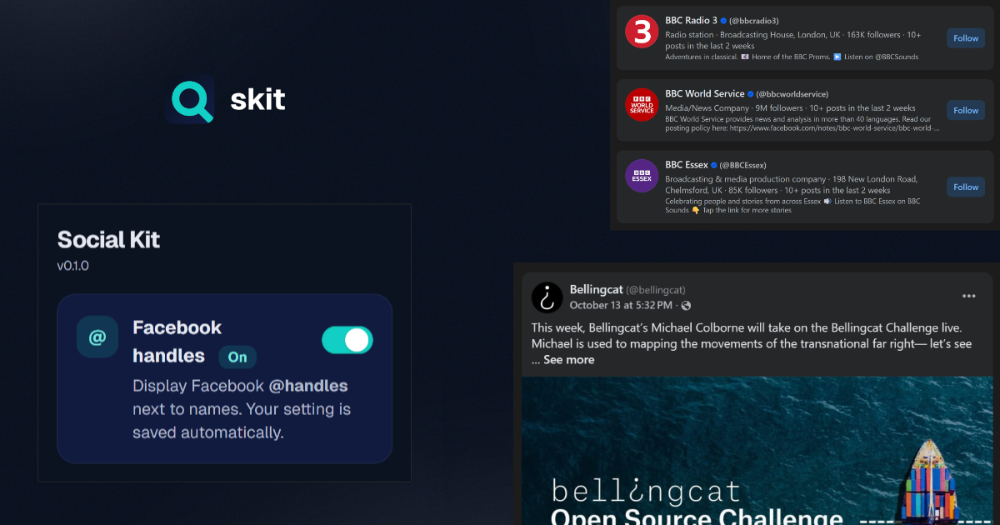

# 🧩 Social Kit – Facebook Handle Helper


A lightweight Chrome extension that displays **Facebook @handles** next to user names.
Built with **TypeScript**, **React**, **TailwindCSS**, **Vite**, and **crxjs**—optimized for dynamic SPA pages.

Future updates will introduce new tools for platforms like Twitter / X, Instagram, TikTok, and LinkedIn, providing a unified workspace for lightweight social-media investigation.

---

## ✨ Features

- Shows **Facebook @handles** beside names
- Auto-updates as you scroll or navigate (SPA-aware)
- Toggle ON/OFF from the popup (setting saved automatically)
- Efficient: `MutationObserver` + `requestIdleCallback`

---



---

## ⚙️ Installation (from source)

1. **Clone**

    ```bash
    git clone https://github.com/gabrielnemeth/skit.git
    cd social-kit
    ```

2. **Install**

    ```bash
    pnpm install
    ```

    _(or `npm install` / `yarn install`)_

3. **Build**

    ```bash
    pnpm build
    ```

    Output goes to `dist/chrome-mv3/`.

4. **Load in Chrome**
    - Open `chrome://extensions`
    - Enable **Developer mode**
    - Click **Load unpacked**
    - Select `dist/`

---

## 🧑‍💻 Development

Live-reload with crxjs:

```bash
pnpm dev
```

Then:

1. Open `chrome://extensions`
2. Enable **Developer mode**
3. **Load unpacked** → select the dev output folder (e.g. `dist/`)
4. Edit files → Chrome reloads the extension automatically

---

## 🧠 How It Works

- **Content script** scans the Facebook DOM for profile links
  (`https://www.facebook.com/<username>` or `profile.php?id=`) and appends `(@username)`.
- Watches DOM mutations and SPA navigation to stay in sync.
- **Popup** (React + Tailwind) toggles a setting stored in `chrome.storage.sync`.
- Content script listens to `chrome.storage.onChanged` and updates immediately.

---

## 🧰 Tech Stack

| Area      | Stack                                 |
| --------- | ------------------------------------- |
| Framework | React 18 + TypeScript                 |
| Styling   | TailwindCSS                           |
| Build     | Vite + crxjs (Manifest v3)            |
| Storage   | `chrome.storage.sync`                 |
| Runtime   | MutationObserver, requestIdleCallback |

---

## 🔒 Permissions

| Permission         | Why                                  |
| ------------------ | ------------------------------------ |
| `storage`          | Save and sync user preferences       |
| `host_permissions` | Allow content script on facebook.com |

---

## 🤝 Contributing

PRs and issues are welcome!

1. Fork the repo
2. `git checkout -b feature/my-improvement`
3. Commit: `git commit -m "feat: add X"`
4. Push: `git push origin feature/my-improvement`
5. Open a Pull Request
